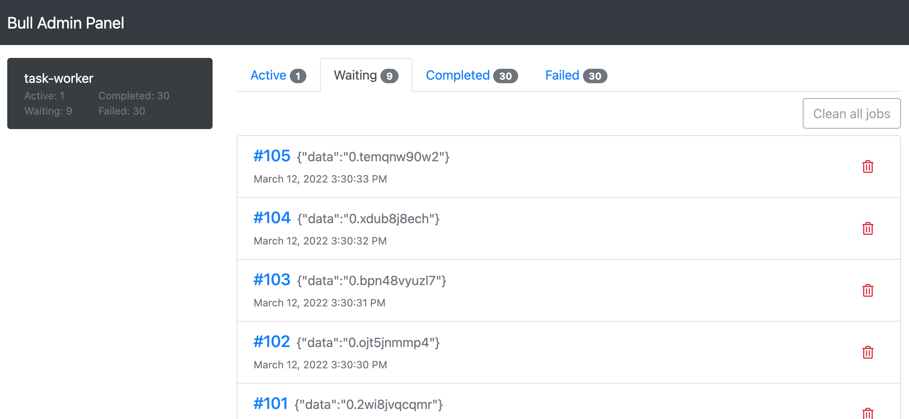

# bull-admin-panel
[](https://www.npmjs.com/package/bull-admin-panel)
[](https://github.com/kelp404/bull-admin-panel/actions)

An admin panel of [Bull](https://github.com/OptimalBits/bull) based on WebSocket.


## Installation
```bash
npm install bull-admin-panel
```

## Screenshots



## Example
[more details...](/example)
```js
const express = require('express');
const http = require('http');
const Bull = require('bull');
const BullAdminPanel = require('bull-admin-panel');

const app = express();
const server = http.createServer(app);
const queue = new Bull('queue-name', {
  redis: {
    host: 'localhost',
    port: 6379,
    db: 1
  }
});

app.use('/bull', new BullAdminPanel({
  basePath: '/bull',
  verifyClient: (info, callback) => {
    // Do authorization for WebSocket.
    // https://github.com/websockets/ws/blob/master/doc/ws.md#new-websocketserveroptions-callback
    callback(true);
  },
  queues: [queue],
  server: server
}));

// Launch server
server.listen(8000, 'localhost', () => {
  const {address, port} = server.address();
  console.log(`Server listening at http://${address}:${port}`);
});
```


## Work with nginx
bull-admin-panel use WebSocket. You need config upgrade request.  
[NGINX as a WebSocket Proxy](https://www.nginx.com/blog/websocket-nginx/)
```
location / {
    proxy_pass http://127.0.0.1:8080;
    proxy_http_version 1.1;
    proxy_set_header Host $host;
    proxy_set_header Upgrade $http_upgrade;
    proxy_set_header Connection $http_connection;
}
```


## Options
### basePath
Type: `string`  
Required: `required`  
The bull admin panel base path. We pass to frontend app.

### socketValidationPath
Type: `string`  
Required: `optional`  
The default value is copy from `basePath`. The websocket just accepts to connect via this path.  
If your site has rewrite path settings. You can use this option.

### verifyClient
Type: `function(info: object, callback: function)`  
Required: `required`  
For websocket authorization.  
More information:
+ [A function which can be used to validate incoming connections.](https://github.com/websockets/ws/blob/master/doc/ws.md#new-websocketserveroptions-callback)
+ [Usage](https://github.com/websockets/ws/issues/377#issuecomment-462152231)

### queues
Type: `Array<Bull>`  
Required: `required`  
Bull instances.
```js
const Bull = require('bull');
const queues = [
  new Bull('queue-a', 'redis://localhost:6379/0'),
  new Bull('queue-b', 'redis://localhost:6379/0')
];
```

### server
Type: `http.Server`  
Required: `required`  
The node.js [http.Server](https://nodejs.org/api/http.html#http_class_http_server) instance.


## Develop
Fork this repository then clone it.  
1. Install node modules.  
`npm install`

2. Start the develop server.    
`npm start`
